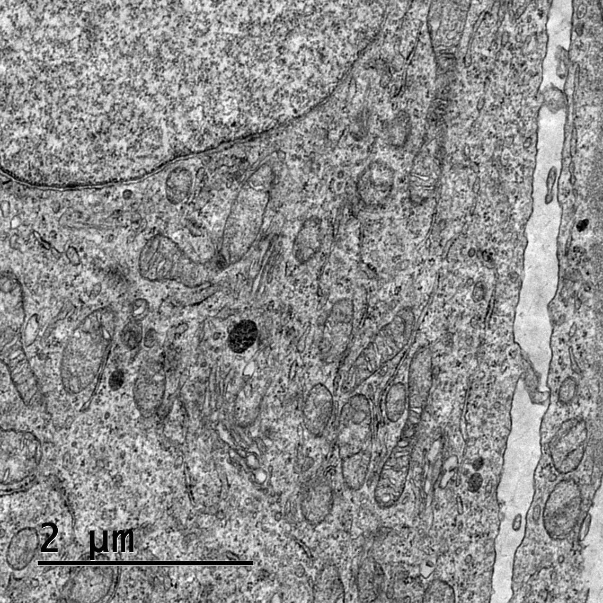

### Materials

- Paraformaldehyde and glutaraldehyde
- PBS (1X)
- 1% Tween-20
- BSA (fat free, acetylated)
- Primary antibody (anti-protein)
- Secondary antibody: an antibody coupled with gold particle
- Uranyl acetate (stain)
- Osmium tetraoxide (contrast)
- Propylene oxide
- Ethanol
- Epon resin
- LR white resin
- Microtome
- Transmission electron microscope

### 1. Sample preparation

Cancer cells or tumor tissue samples are collected and washed with phosphate buffer to remove debris.

### 2. Primary fixation

The samples for TEM are fixed by two different ways: (1) immersion or (2) perfusion. Fixation time and concentration of fixative agents depend on tissue thickness. It is performed in the following steps:

- Sample is incubated with 2% paraformaldehyde / 2.5% glutaraldehyde in 50 mM sodium cacodylate pH 7.4 for overnight at 4 °C.

### 3. Post-fixation

Post fixation, samples are incubated with 2% osmium tetraoxide in 50 mM sodium cacodylate pH 7.4 for overnight at 4 °C.

### 4. Dehydration

Biological samples are fragile and contain a large amount of water. Water present in the biological sample diffracts electron rays and may increase the background signal. Following osmium fixation, water is chemically extracted from the specimen using a graded series of ethanol. It is performed in the following steps:

1. Sample is incubated with 50% ethanol for 30 mins.
2. Sample is incubated with 70% ethanol for 30 mins.
3. Sample is incubated with 80% ethanol for 30 mins.
4. Sample is incubated with 90% ethanol for 30 mins.
5. Sample is incubated with 95% ethanol for 30 mins.
6. Sample is incubated with 100% ethanol for 30 mins.
7. Sample is incubated with anhydrous ethanol for 30 mins.

### 5. Embedding

A thin (~10 nm-100 nm) section of the sample is needed so that electrons can pass through it to form an image. Biological samples are fragile and cannot be processed to cut thin sections. Hence, the sample needs to be embedded into a solid matrix to cut the sections.

| Epon embedding                                                                                                                                                                                                                                                                                                                                          | LR white embedding                                                                                                                                                                                                                                                                                                                                                                                                                                                                                                                  |
| ------------------------------------------------------------------------------------------------------------------------------------------------------------------------------------------------------------------------------------------------------------------------------------------------------------------------------------------------------- | ----------------------------------------------------------------------------------------------------------------------------------------------------------------------------------------------------------------------------------------------------------------------------------------------------------------------------------------------------------------------------------------------------------------------------------------------------------------------------------------------------------------------------------- |
| Remove the solution and sample is incubated with propylene oxide : Epon resin (1:1) overnight. Remove the solution and sample is incubated with fresh Epon 812 resin for additional 1-5 hrs. Dispense a few µl of fresh Epon 812 resin in polyethylene capsules and the specimen is transferred into it. Place capsule at 60 °C in hot oven for 48 hrs. | Dehydrate the specimen in ethanol as described. Incubate tissue or cells for 30 min in a mixture of ethanol and LR white resin (1:1). Subsequently, incubate tissue or cells for 30 min in a mixture of ethanol and LR white resin (2:1). Incubate tissue or cells in LR white resin for 1 hr; repeat this step 3 times. Finally leave the tissue or cells overnight in 100% LR white resin. Fill the capsule with LR white containing tissue/cell and seal the capsule to allow polymerization of resin in a 50 °C oven overnight. |

### 6. Staining

Initially, thick sections are cut with the help of a razor blade to reach the tissue in the block. Afterwards, the block is mounted on the microtome and ultra-thin (10-100 nm) sections are cut and floated onto the water placed within the boat. Cut sections are stacked on each other in a definite pattern known as **"ribbon"**. These ribbons are collected on an electron microscope grid.

**Staining to visualize cell structure:** Incubate the grid in uranyl acetate for 2 hrs and subsequently in lead citrate for an additional 2 hrs. Uranyl acetate staining will allow one to observe the cellular structure and to study the changes in the cellular or sub-cellular morphology.

### 7. TEM imaging

Prepared grids are examined under a transmission electron microscope, and images of mitochondria are captured at appropriate magnifications.

**Observation:** Cells were observed with a transmission electron microscope. Figure 2 depicts TEM images of breast cancer MDA-MB231 cells with mitochondria.

<b>Figure 2: TEM images of Mitochondria from breast cancer MDA-MB231 cells</b> (Image courtesy: Dr. Kalyan Mitra, Scientist, CSIR-CDRI, Lucknow, India).

---

## Video Demonstration

