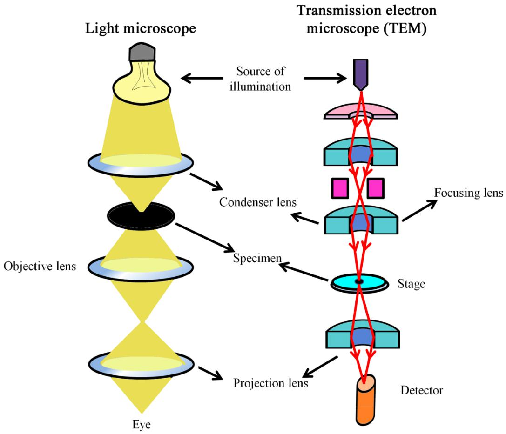

Transmission Electron Microscopy (TEM) is an imaging technique used to study the ultrastructure of cellular organelles at the level of nanometer (10-9) resolution. Unlike light microscopy, TEM uses a beam of high-energy electrons that passes through ultrathin sections of biological specimens. Figure 1 explains the pathway and comparison as well. The interaction of electrons with cellular components generates high-contrast images of internal structures.

The image in this microscopy is generated by the electrons that have transmitted through a thin specimen. Transmission electron microscopes usually have thermionic emission guns and electrons are accelerated anywhere between 40-200 kV potential. However, TEM with >1000 kV acceleration potentials have been developed for obtaining higher resolutions. Owing to their brightness and very fine electron beams, field emission guns are becoming more popular as the electron guns.

<b>Figure 1: Comparison of optical pathways in a light microscope and a transmission electron microscope (TEM), highlighting differences in illumination, lenses, and image detection.</b>

Proper fixation, dehydration, embedding, ultrathin sectioning, and heavy-metal staining are essential to preserve mitochondrial architecture. TEM allows detailed visualization of mitochondrial membranes, cristae organization, and matrix density, enabling comparison between normal and cancerous cellular states.
